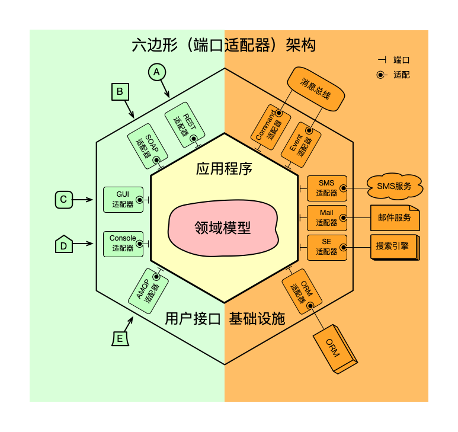
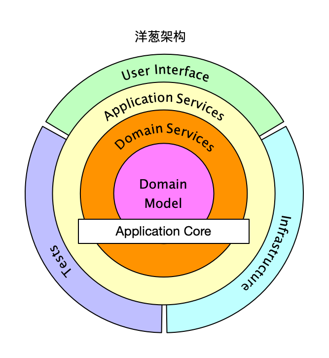
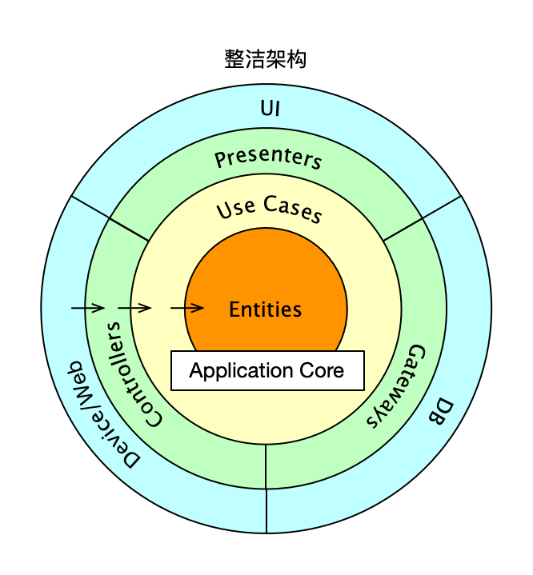

# 工程结构介绍

## 模块依赖关系

    --------------              --------------
    |            |              |            |
    |   client   |              |  service   |_ __ __ __ __ __ __ __ __ __ __ __ _
    |            |              |            |                                    \                 
    --------------              --------------                                     \                
                \                 /        \                                        \               
                 \               /          \                                        \              
                  \             /            \                                        \             
                  _\|         |/_            _\|                                      _\|           
                  --------------               ---------------               --------------------   
                  |            |               |             |               |                  |   
                  |     api    |               | application |               |  infrastructure  |   
                  |            |               |             |               |                  |   
                  --------------               ---------------               --------------------   
                                                             \                  /                   
                                                              \                /                    
                                                               \              /                     
                                                               _\|          |/_                     
                                                                --------------                      
                                                                |            |                      
                                                                |   domain   | 
                                                                |            |
                                                                --------------

## 常见架构模式






## 设计规范
- 
## 各个模块职责

- domain：领域服务层
    - 领域模型层：领域对象model、领域服务service、资源库repository、事件event、查询门面facade
    - 代码结构如下
    ```
    - com.${company}.${businessdomain}.${context}.${aggregateroot}
      \- domain
      |- service
      |- facade
      |- model
      |- event
      \- repository
    ```
- application：应用服务层
    - 面向用例或用户故事，实现处理流程（service）、处理节点（action）
    - 代码结构如下
    ```
    - com.${company}.${businessdomain}.${context}.${aggregateroot}
      \- application
        |- service
        |- action
        |- command
        |- query
        \- result
    ```
- infrastructure：资源层，实现数据访问
    - 含数据访问对象dao、数据库配置config、数据对象entity、数据映射mapper、数据对象&领域对象工厂
    - 代码结构如下
    ```
    - com.${company}.${businessdomain}.${context}.${aggregateroot}
      \- infrastructure
        |- dao
        |- config
        |- entity
        |- mapper
        |- message
        |- dal
        |- call
        \- factory
   ```
- api：公共api包，含公共常量&通用定义，服务接口定义
    - RPC服务接口定义Service（api领域开放接口，service领域封闭接口，open开放接口）
    - 输入输出对象：Request、Response、DTO
    - 开放的常量const、枚举enum、通用util类、异常类
    - 代码结构如下
    ```java
    - com.${company}.${businessdomain}.${context}
      |- common
      | |- consts
      | |- enums
      | \- exception
    - com.${company}.${businessdomain}.${context}.${aggregateroot}
      \- api|service|open
        |- module
        | |- request
        | |- response
        | \- dto
        \- ${Aggregate}Service
      ```
- client：实现富客户端
    - 富客户端
    - 代码结构如下
    ```
    - com.${company}.${businessdomain}.${context}.${aggregateroot}
      \- ${Aggregate}Client
    ```
- service：用户接口层，即表现层，实现表现层逻辑（协议、输入&输出转换）
    - 定义service层接口（HTTP协议）和实现（RPC协议）
    - 代码结构如下
    ```
    - com.${company}.${businessdomain}.${context}.${aggregateroot}
        |- message
        | |- consumer  
        | \- listener
        |- job
        | |- task
        | \- handle|- service
        |- rpc
        | \- ${Aggregate}ServiveImpl
        \- web
          |- controller
          |  \- ${Aggregate}Controller
          |- request
          |- response
          |- config
          \- filter    
    ```